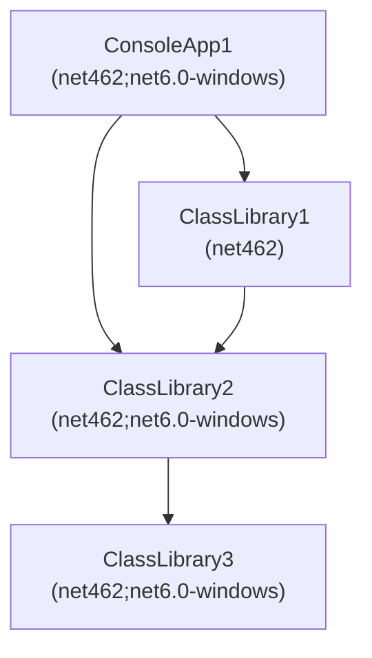

[Build Acceleration](https://github.com/dotnet/project-system/blob/main/docs/build-acceleration.md) might copy different target platform assemblies compared to msbuild when targeting multiplatform assemblies.
The condition for this to happen is:
 
* ProjectA (multi target platform) references ProjectB (single target platform).
* ProjectB (single target platform) references ProjectC (multi target platform).
* ProjectA (multi target platform) references ProjectC (multi target platform).

Then the output folder of ProjectA might contain a different platform target of ProjectCs binary.

See also [this issue](https://github.com/dotnet/project-system/issues/8908) in dotnet/project-system.

## Dependency Diagram



After modifying the implementation in ClassLibrary2 and performing an incremental build, in the ConsoleApp1 `net6.0-windows` output folder there is a

* ClassLibrary2 with `net462` target platform when copied via build acceleration, or a
* ClassLibrary2 with `net6.0-windows` target platform when copied via msbuild (no build acceleration).

## Repro Steps

* Checkout the project using `git clone https://github.com/johanneszab/vs_buildacceleration.git`.
* Open the solution `sample/acceleration.sln` in VS, build it.
* Change the `TestMethod` implementation in `ClassLibrary2\Class2.cs` to trigger Build Acceleration.
* See the example [build acceleration output](logs/acceleration_log_minimal.txt) and [msbuild output](logs/msbuild_log_normal.txt):
  * Build Acceleration: `net462` ClassLibrary2 (targets `net462;net6.0-windows`) is copied to the `net6.0-windows` output folder of ConsoleApp1.
  * MSBuild: `net6.0-windows` ClassLibrary2 is copied to the `net6.0-windows` output folder of ConsoleApp1.

## Outputs

### Build Acceleration

```c#
6>FastUpToDate: Checking configuration Debug|AnyCPU|net462: (ConsoleApp1)
6>FastUpToDate:     Comparing timestamps of inputs and outputs: (ConsoleApp1)
6>FastUpToDate:         No inputs are newer than earliest output 'D:\acceleration\sample\ConsoleApp1\bin\Debug\net462\ConsoleApp1.exe' (2023-03-19 12:30:26.178). Newest input is 'D:\acceleration\sample\ClassLibrary1\obj\Debug\net462\ref\ClassLibrary1.dll' (2023-03-19 12:30:26.026). (ConsoleApp1)
6>FastUpToDate: Checking configuration Debug|AnyCPU|net6.0-windows: (ConsoleApp1)
6>FastUpToDate:     Comparing timestamps of inputs and outputs: (ConsoleApp1)
6>FastUpToDate:         No inputs are newer than earliest output 'D:\acceleration\sample\ConsoleApp1\obj\Debug\net6.0-windows\ConsoleApp1.pdb' (2023-03-19 12:30:26.211). Newest input is 'D:\acceleration\sample\ClassLibrary1\obj\Debug\net462\ref\ClassLibrary1.dll' (2023-03-19 12:30:26.026). (ConsoleApp1)
6>FastUpToDate: Copying 6 files to accelerate build (https://aka.ms/vs-build-acceleration): (ConsoleApp1)
6>FastUpToDate:     From 'D:\acceleration\sample\ClassLibrary2\bin\Debug\net462\ClassLibrary2.pdb' to 'D:\acceleration\sample\ConsoleApp1\bin\Debug\net462\ClassLibrary2.pdb'. (ConsoleApp1)
6>FastUpToDate:     From 'D:\acceleration\sample\ClassLibrary2\bin\Debug\net462\ClassLibrary2.dll' to 'D:\acceleration\sample\ConsoleApp1\bin\Debug\net462\ClassLibrary2.dll'. (ConsoleApp1)
6>FastUpToDate:     From 'D:\acceleration\sample\ClassLibrary2\bin\Debug\net6.0-windows\ClassLibrary2.pdb' to 'D:\acceleration\sample\ConsoleApp1\bin\Debug\net6.0-windows\ClassLibrary2.pdb'. (ConsoleApp1)
6>FastUpToDate:     From 'D:\acceleration\sample\ClassLibrary2\bin\Debug\net6.0-windows\ClassLibrary2.dll' to 'D:\acceleration\sample\ConsoleApp1\bin\Debug\net6.0-windows\ClassLibrary2.dll'. (ConsoleApp1)
6>FastUpToDate:     From 'D:\acceleration\sample\ClassLibrary2\bin\Debug\net462\ClassLibrary2.pdb' to 'D:\acceleration\sample\ConsoleApp1\bin\Debug\net6.0-windows\ClassLibrary2.pdb'. (ConsoleApp1)
6>FastUpToDate:     From 'D:\acceleration\sample\ClassLibrary2\bin\Debug\net462\ClassLibrary2.dll' to 'D:\acceleration\sample\ConsoleApp1\bin\Debug\net6.0-windows\ClassLibrary2.dll'. (ConsoleApp1)
6>FastUpToDate: Build acceleration copied 6 files. (ConsoleApp1)
6>FastUpToDate: Project is up-to-date. (ConsoleApp1)
```

### MSBuild:

```c#
6>------ Build started: Project: ConsoleApp1, Configuration: Debug Any CPU ------
6>Build started 19.03.2023 14:06:39.
6>Target DispatchToInnerBuilds:
6>  Target ProcessFrameworkReferences:
6>  Target _GetProjectReferenceTargetFrameworkProperties:
6>    Target _GetProjectReferenceTargetFrameworkProperties:
6>      Target GetTargetFrameworksWithPlatformFromInnerBuilds:
6>      C:\Program Files\Microsoft Visual Studio\2022\Professional\MSBuild\Current\Bin\amd64\Microsoft.Common.CurrentVersion.targets(1830,5): warning NU1702: ProjectReference 'D:\acceleration\sample\ClassLibrary1\ClassLibrary1.csproj' was resolved using '.NETFramework,Version=v4.6.2' instead of the project target framework '.NETCoreApp,Version=v6.0'. This project may not be fully compatible with your project.
6>    Done building target "_GetProjectReferenceTargetFrameworkProperties" in project "ConsoleApp1.csproj".
6>    Target ResolveProjectReferences:
6>    Target ResolveTargetingPackAssets:
6>    Target _WriteAppConfigWithSupportedRuntime:
6>      Skipping target "_WriteAppConfigWithSupportedRuntime" because all output files are up-to-date with respect to the input files.
6>    Target GenerateBindingRedirects:
6>      No suggested binding redirects from ResolveAssemblyReferences.
6>    Target GenerateTargetFrameworkMonikerAttribute:
6>      Skipping target "GenerateTargetFrameworkMonikerAttribute" because all output files are up-to-date with respect to the input files.
6>    Target CoreGenerateAssemblyInfo:
6>      Skipping target "CoreGenerateAssemblyInfo" because all output files are up-to-date with respect to the input files.
6>    Target CoreCompile:
6>      Skipping target "CoreCompile" because all output files are up-to-date with respect to the input files.
6>    Target _CopyFilesMarkedCopyLocal:
6>      Copying file from "D:\acceleration\sample\ClassLibrary2\bin\Debug\net462\ClassLibrary2.pdb" to "D:\acceleration\sample\ConsoleApp1\bin\Debug\net462\ClassLibrary2.pdb".
6>      Copying file from "D:\acceleration\sample\ClassLibrary2\bin\Debug\net462\ClassLibrary2.dll" to "D:\acceleration\sample\ConsoleApp1\bin\Debug\net462\ClassLibrary2.dll".
6>      Touching "D:\acceleration\sample\ConsoleApp1\obj\Debug\net462\ConsoleApp1.csproj.CopyComplete".
6>    Target GetCopyToOutputDirectoryItems:
6>      Target CopyAdditionalFiles:
6>      Target AssignTargetPaths:
6>    Target _CopyAppConfigFile:
6>      Skipping target "_CopyAppConfigFile" because all output files are up-to-date with respect to the input files.
6>    Target CopyFilesToOutputDirectory:
6>      ConsoleApp1 -> D:\acceleration\sample\ConsoleApp1\bin\Debug\net462\ConsoleApp1.exe
6>
6>    Done building project "ConsoleApp1.csproj".
6>  Target GenerateTargetFrameworkMonikerAttribute:
6>    Skipping target "GenerateTargetFrameworkMonikerAttribute" because all output files are up-to-date with respect to the input files.
6>  Target CoreGenerateAssemblyInfo:
6>    Skipping target "CoreGenerateAssemblyInfo" because all output files are up-to-date with respect to the input files.
6>  Target CoreCompile:
6>    Skipping target "CoreCompile" because all output files are up-to-date with respect to the input files.
6>  Target _CreateAppHost:
6>    Skipping target "_CreateAppHost" because all output files are up-to-date with respect to the input files.
6>  Target _CopyFilesMarkedCopyLocal:
6>    Copying file from "D:\acceleration\sample\ClassLibrary2\bin\Debug\net6.0-windows\ClassLibrary2.pdb" to "D:\acceleration\sample\ConsoleApp1\bin\Debug\net6.0-windows\ClassLibrary2.pdb".
6>    Copying file from "D:\acceleration\sample\ClassLibrary2\bin\Debug\net6.0-windows\ClassLibrary2.dll" to "D:\acceleration\sample\ConsoleApp1\bin\Debug\net6.0-windows\ClassLibrary2.dll".
6>    Touching "D:\acceleration\sample\ConsoleApp1\obj\Debug\net6.0-windows\ConsoleApp1.csproj.CopyComplete".
6>  Target GetCopyToOutputDirectoryItems:
6>    Target _GetCopyToOutputDirectoryItemsFromTransitiveProjectReferences:
6>  Target _CopyOutOfDateSourceItemsToOutputDirectory:
6>    Skipping target "_CopyOutOfDateSourceItemsToOutputDirectory" because all output files are up-to-date with respect to the input files.
6>  Target GenerateBuildDependencyFile:
6>    Skipping target "GenerateBuildDependencyFile" because all output files are up-to-date with respect to the input files.
6>  Target GenerateBuildRuntimeConfigurationFiles:
6>    Skipping target "GenerateBuildRuntimeConfigurationFiles" because all output files are up-to-date with respect to the input files.
6>  Target CopyFilesToOutputDirectory:
6>    ConsoleApp1 -> D:\acceleration\sample\ConsoleApp1\bin\Debug\net6.0-windows\ConsoleApp1.dll
6>
6>Build succeeded.
```
